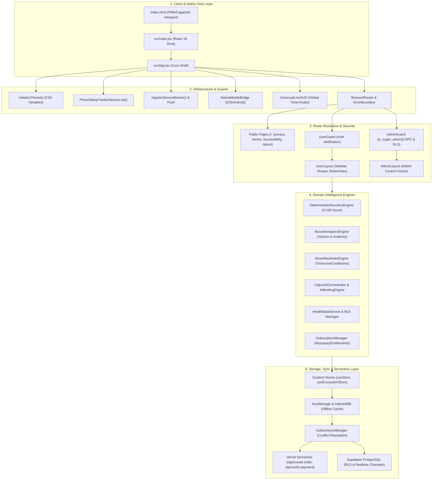
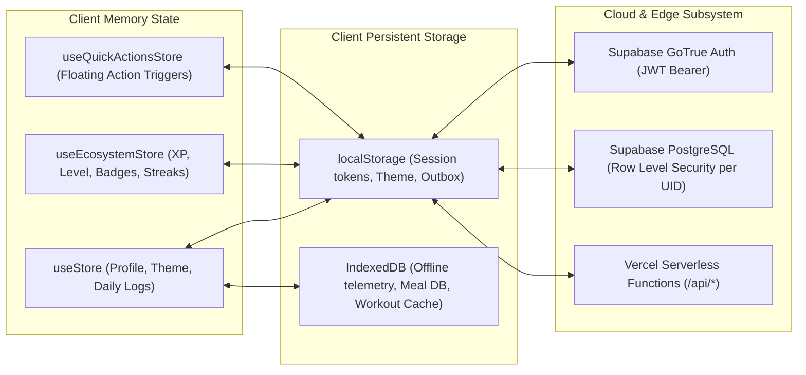

# CALYXO — COMPLETE END-TO-END APPLICATION ARCHITECTURE

This document provides the definitive, end-to-end architectural specification for **Calyxo** (`CALYXOAPP`), documenting every phase of the application from boot and initialization to runtime execution, background synchronization, and teardown.

---

## 1. High-Level System Architecture Diagram



---

## 2. Boot & Initialization Pipeline (Cold Start)

```
[Browser / WebView Cold Start]
       │
       ▼
1. index.html parses head metadata, PWA manifests, and Google Fonts (Outfit / Inter)
       │
       ▼
2. src/main.jsx mounts React 18 createRoot(document.getElementById('root'))
       │
       ▼
3. src/App.jsx triggers initial bootstrap in useEffect():
       ├── initializeTheme(): Reads local preference or OS media query -> Injects CSS tokens
       ├── PhoneSleepTrackerService.init(): Binds motion/gyro sensors & screen-lock listeners
       └── registerServiceWorker(): Registers SW -> scheduleDailyReminders()
       │
       ▼
4. Global Shell Components Mount:
       ├── <HelmetProvider>: Manages SEO meta tags and dynamic page titles
       ├── <ErrorBoundary>: Catches unhandled render crashes with friendly recovery UI
       ├── <BrowserRouter>: Client-side routing with clean URL preservation
       ├── <NativeMobileBridge>: Hooks Capacitor native events (back button, status bar, deep links)
       └── <UniversalLiveHUD>: Mounts floating rest timer HUD, haptics, and audio pulse
```

---

## 3. Global Providers & Security Guards

Calyxo uses a multi-tiered security and layout pipeline:

```
                                  Incoming Route
                                        │
        ┌───────────────────────────────┼──────────────────────────────┐
        ▼                               ▼                              ▼
  Public Routes                   User Routes                    Admin Routes
  (/, /about, /privacy,        (/user/dashboard,              (/admin/dashboard,
   /terms, /accessibility)      /user/workout, ...)            /admin/users, ...)
        │                               │                              │
  Renders directly              <UserGuard>                    <AdminGuard>
  (Zero forced redirect         Checks Supabase session        Checks Supabase Auth
   from root '/')               or demo mode. Redirects        + is_super_admin() RPC.
                                to login if unauthenticated.   Blocks unauthorized users.
                                        │                              │
                                        ▼                              ▼
                                  <UserLayout>                   <AdminLayout>
                                (PageErrorBoundary             (Analytics, User Mgmt,
                                 per sub-route)                 Revenue, Database CRUD)
```

---

## 4. State Management & Storage Topology



---

## 5. Core Domain Intelligence Engines (Runtime Services)

### 1. Deterministic Recovery Engine (`DeterministicRecoveryEngine.js`)
- **Mathematical Inputs**: Sleep duration, water intake, protein intake, resting HR vs baseline, subjective DOMS/soreness (1-10), fatigue (1-10), active energy burn.
- **Output**: Bounded `totalScore` (0-100), `readinessStatus` (`PEAK`, `OPTIMAL`, `MAINTENANCE`, `RECOVERY_REQUIRED`), and mathematical `breakdown` dictionary.
- **Deterministic**: 100% pure functional algorithm; identical biometrics always produce strictly identical recovery scores.

### 2. Muscle Analytics & Anatomical Map (`MuscleAnalyticsEngine.js`)
- **Telemetry Processed**: Workout logs, sets, reps, weight (kg), RPE, exercise target muscle groups.
- **Output**: Active vs understimulated muscle balance, 7-day volume accumulation, hyper-specific anatomical map SVG stimulus vectors, and progressive overload tracking.

### 3. Smart Reminder & Cooldown Engine (`SmartReminderEngine.js`)
- **Context-Aware Evaluation**: Resolves user's real IANA timezone (`Intl.DateTimeFormat`).
- **30-Day Rolling Cooldown**: Prevents repetitive notifications or duplicated jokes.
- **Immediate Suppression**: Logging water ($\ge 250\text{ml}$), completing a workout, or tracking lunch immediately suppresses pending OS notification milestones.

### 4. Explainable AI Coach & Grounded Briefing (`AIBriefingEngine.js` & `CalyxoAIOrchestrator.js`)
- **Truthfulness Guardrails**: Synthesizes verified facts from actual user logs.
- **Fallback Mode**: Gracefully generates heuristic recommendations when cloud Gemini API is offline or unconfigured.
- **Chat Session Lifecycle**: Supports session pinning, renaming, message appending, and clean history clearing.

### 5. Wearable & Sensor Bridge (`HealthDataService.js` & `BluetoothHealthService.js`)
- **Data Freshness Engine**: Classifies data as `LIVE` ($<30\text{s}$), `RECENT` ($<10\text{m}$), `STALE` ($<24\text{h}$), or `UNAVAILABLE`.
- **Zero Fake Data on Disconnect**: When BLE HR monitors or watches disconnect, telemetry safely emits `null` rather than a simulated 72 BPM.

### 6. Payment & Entitlement Security (`SubscriptionManager.js` & `razorpay.js`)
- **Authoritative Catalog**: Orders derive price on the backend (`HIGH` = ₹2 / 200 paise, `HIGH_ANNUAL` = ₹199 / 19900 paise), ignoring client amount inputs.
- **HMAC-SHA256 Signature Verification**: Cryptographic signature validation ensures zero fraudulent entitlement grants.
- **Duration Resolution**: Automatically assigns 30 days for Monthly and 365 days for Annual subscriptions.

---

## 6. Offline-First Sync & Conflict Resolution Pipeline

```
[User Action: Log Meal / Set / Water / Weight]
                     │
                     ▼
       1. Optimistic Client State Update (Zustand + UI Reactivity)
                     │
                     ▼
       2. Enqueue Event in OutboxSyncManager (IndexedDB / localStorage)
                     │
         ┌───────────┴───────────┐
         ▼                       ▼
    [Online]                 [Offline]
         │                       │
3. Flush to Supabase     Queue held safely in Outbox;
   via HTTPS / Edge API  persists across app restarts.
         │                       │
         │                [Network Restored]
         │                       │
         └──────────────► 4. Conflict Resolution Strategy:
                             ├── Workout Sets: Union merge by setIndex (preserves max reps & completion)
                             ├── Hydration: Additive deduplicated merge
                             ├── Settings / Profile: Last-Write-Wins (LWW) via ISO timestamp
                             └── Biometrics: Deduplicated by source + minute timestamp
```

---

## 7. App Suspension, Backgrounding & Teardown (App Close)

When a user switches apps, locks the device, navigates away, or closes Calyxo:

```
[App Suspension / Backgrounding / Window Unload Triggered]
                     │
                     ▼
1. Capacitor & Window Event Listeners Fire:
   ├── App.addListener('appStateChange', ({ isActive }) => ...)
   ├── document.addEventListener('visibilitychange')
   └── window.addEventListener('beforeunload')
                     │
                     ▼
2. State Serialization & Sync:
   ├── Active workout timer state is persisted to local storage
   ├── Unsent outbox mutations are flushed / persisted to disk
   └── Chat session timestamps and scroll offsets are saved
                     │
                     ▼
3. Resource Cleanup & Detachment:
   ├── UniversalLiveHUD audio context and timers are cleanly stopped
   ├── Bluetooth GATT connections and BLE scan intervals are closed
   ├── Phone accelerometer / gyroscope device motion listeners are detached
   ├── Active Supabase Realtime WebSocket channels are unsubscribed
   └── Service Worker background sync takes over daily reminder scheduling
                     │
                     ▼
4. Clean Process Exit / Zero Memory Leaks
```

---

## 8. Summary Architecture Highlights

1. **Routing Invariant**: Navigating to `/` renders the high-performance `HomePage` / `LandingPage` without forced redirection.
2. **Resilience**: Every protected page is individually isolated with `<PageErrorBoundary>`, ensuring a single render exception never crashes the entire application shell.
3. **Multi-Platform Parity**: Bridges seamlessly between Web (PWA), iOS (Capacitor + HealthKit Swift plugin), and Android (Health Connect).
4. **Security & Privacy**: Zero third-party advertising cookies; strict Row Level Security (RLS) database policies; server-authoritative payment calculations.
