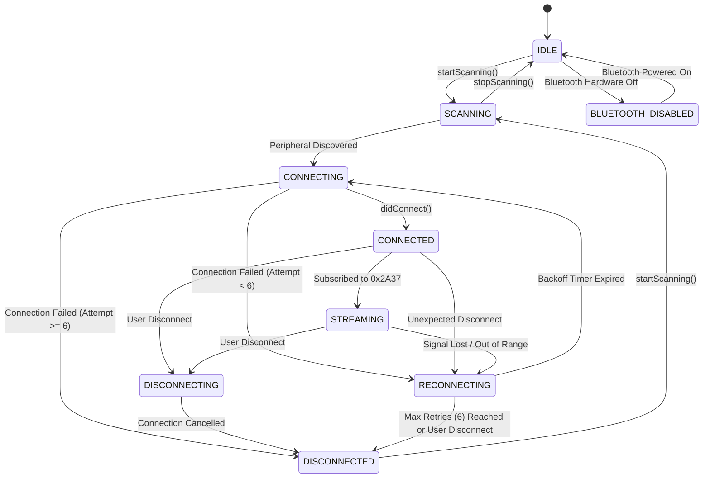

# CALYXO — NATIVE BLE FINITE STATE MACHINE & PROTOCOL SPECIFICATION

**Platform**: Calyxo Unified Health Operating System (`CALYXOAPP`)  
**Specification Type**: Phase 4B — CoreBluetooth & Android BLE State Machine Specification  
**GATT Services**: Heart Rate Service (`0x180D`), Battery Service (`0x180F`)  
**Date**: August 28, 2026  

---

## 1. 9-State Finite State Machine Diagram



---

## 2. State Definitions & Behavioral Rules

| State | Entry Condition | Observable Actions | Exit Condition |
| :--- | :--- | :--- | :--- |
| **`IDLE`** | App launch / scan stopped | Bluetooth radio idle; no battery drain | `startScanning()` invoked |
| **`SCANNING`** | User opens sensor sheet | Scans for Service `0x180D` | Peripheral found or timeout |
| **`CONNECTING`** | Target peripheral selected | Dispatches native `connectGatt` | Connected or connection timeout |
| **`CONNECTED`** | Link established | Discovers services & characteristics | Subscribed to `0x2A37` |
| **`STREAMING`** | `0x2A37` notifications active | Parses live BPM & RR packets | Signal lost or disconnect |
| **`DISCONNECTING`** | User taps "Disconnect" | Clears telemetry to `NULL`; cancels link | Link closed |
| **`DISCONNECTED`** | Link closed | Radio idle; zero reconnection scheduled | `startScanning()` invoked |
| **`RECONNECTING`** | Unexpected signal drop | Schedules exponential backoff timer | Backoff expires or max attempts hit |
| **`BLUETOOTH_DISABLED`**| OS Bluetooth toggled off | Emits warning to user | User enables Bluetooth |

---

## 3. Bounded Exponential Backoff Policy

When a peripheral disconnects unexpectedly (e.g., athlete walks out of range), the native client executes bounded exponential backoff to conserve battery life:

$$\text{Delay}(n) = \min\left(30\text{s}, 2^{n - 1}\text{s}\right) \quad \text{for } n \in [1, 6]$$

| Reconnect Attempt | Delay Before Attempt | Cumulative Elapsed Time | Action upon Failure |
| :--- | :--- | :--- | :--- |
| **Attempt 1** | $1\text{ second}$ | $1\text{s}$ | Increment attempt counter |
| **Attempt 2** | $2\text{ seconds}$ | $3\text{s}$ | Increment attempt counter |
| **Attempt 3** | $4\text{ seconds}$ | $7\text{s}$ | Increment attempt counter |
| **Attempt 4** | $8\text{ seconds}$ | $15\text{s}$ | Increment attempt counter |
| **Attempt 5** | $16\text{ seconds}$ | $31\text{s}$ | Increment attempt counter |
| **Attempt 6** | $30\text{ seconds}$ (Capped) | $61\text{s}$ | **Terminate Reconnect -> `DISCONNECTED`** |

---

## 4. GATT Characteristic 0x2A37 Binary Decoder

```text
Byte Offset:   [0]        [1]        [2]        [3]        [4] ...
Contents:    [Flags]   [BPM LSB]  [BPM MSB*] [RR LSB*]  [RR MSB*]

Flag Bit Mask:
- Bit 0: Heart Rate Value Format (0 = UINT8, 1 = UINT16)
- Bit 1-2: Sensor Contact Status (00/01 = Not Supported, 10 = No Contact, 11 = Contact Detected)
- Bit 3: Energy Expended Present (0 = No, 1 = Yes)
- Bit 4: RR-Intervals Present (0 = No, 1 = Yes)

RR-Interval Millisecond Conversion:
RR (ms) = (Raw UINT16 / 1024.0) * 1000.0
```
