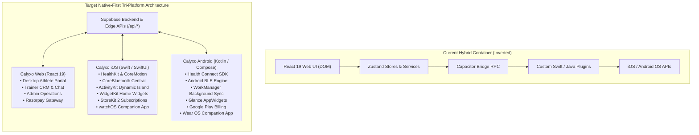
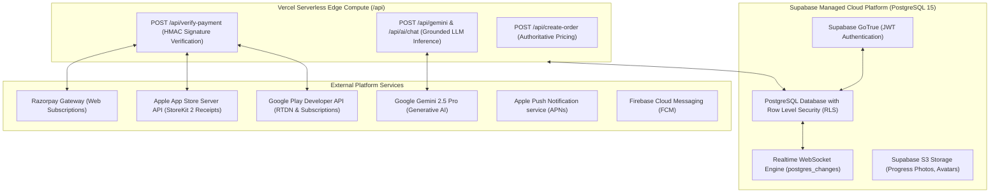
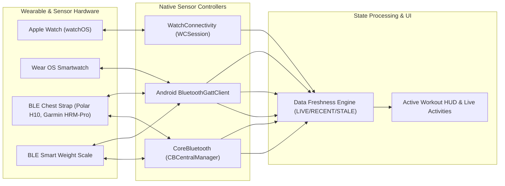
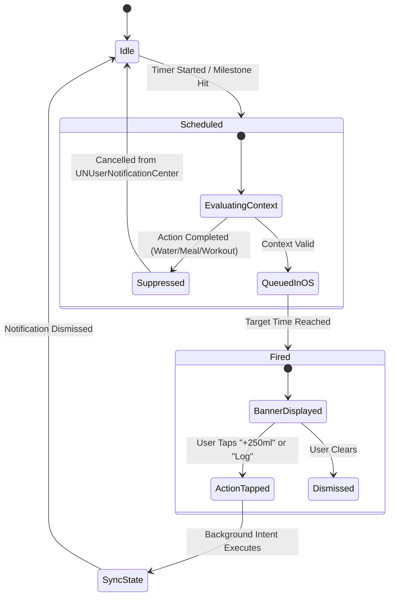

# CALYXO — ENTERPRISE NATIVE-FIRST ARCHITECTURE & MIGRATION BLUEPRINT

**Platform**: Calyxo Unified Health Operating System (`CALYXOAPP`)  
**Document Type**: Phase 3 — Enterprise Native Migration Plan & Architecture Blueprint  
**Mode**: Architectural Design & Technical Specification (Zero Application Code Alterations)  
**Target Delivery**: Apple Health & Google Health Grade Native Applications  
**Platforms Covered**: Web (React 19 / Vite), iOS (Swift / SwiftUI), watchOS, Android (Kotlin / Jetpack Compose), Wear OS  
**Date**: August 28, 2026  

---

## 1. Executive Summary

This blueprint specifies the **complete, zero-break architectural migration** of Calyxo from its current hybrid React 19 + Vite + Capacitor 8 architecture into a **tri-platform native-first health system**:

```
                              CALYXO PLATFORM
                                     │
                   Shared Cloud & Edge Infrastructure
             (Supabase PostgreSQL, RLS, Edge APIs, Gemini AI)
                                     │
        ┌────────────────────────────┼────────────────────────────┐
        ▼                            ▼                            ▼
   CALYXO WEB                   CALYXO iOS                  CALYXO ANDROID
 React 19 / Vite             Swift / SwiftUI           Kotlin / Jetpack Compose
 Desktop & Admin             iPhone + Apple Watch         Android + Wear OS
 Razorpay Gateway            StoreKit 2 Subscriptions    Google Play Billing
 Web PWA Optional            HealthKit & ActivityKit     Health Connect & Glance
```

### Strategic Tenets
1. **Zero Production Disruption**: The current live production Web app, mobile Capacitor container, Supabase database, and Vercel serverless edge functions continue to operate without alteration during development.
2. **Unified Data & Identity Layer**: Existing users log into native iOS or Android apps with their current credentials and access their entire historical training logs, body composition telemetry, active subscriptions, and AI memory immediately.
3. **Hardware-First Performance**: Native mobile clients bypass WebView execution boundaries, achieving 120Hz ProMotion UI rendering, instant cold boots ($<400\text{ms}$), true background HealthKit delivery, real-time BLE GATT streaming, Lock Screen Live Activities, and interactive Home Screen widgets.

---

## 2. Current vs. Target Architecture Topology



---

## 3. Layered Platform Architecture

### Layer 1: Platform Backend & Infrastructure



### Layer 2: Platform-Independent Domain Core

The Calyxo Domain Core contains **zero UI code, zero framework dependencies, and zero DOM/storage references**. It represents the pure business contracts, physiological algorithms, and conflict rules implemented identically across TypeScript (Web), Swift (iOS), and Kotlin (Android):

```text
CALYXO DOMAIN CORE (Pure Contracts & Mathematical Engines)
│
├── 1. Physiological & Biometric Algorithms
│   ├── Deterministic Recovery Engine (0-100 Score, Readiness Tiers, Penalty Breakdown)
│   ├── Clinical Sleep Quality Scorer (Duration curve -> Restorative score)
│   ├── BMR / TDEE Macro Calculator (Mifflin-St Jeor equation + Goal modifiers)
│   └── Biometric Freshness State Classifier (LIVE <30s, RECENT <10m, STALE <24h, UNAVAILABLE)
│
├── 2. Exercise Science & Muscle Analytics
│   ├── Exercise Anatomy Taxonomy (50+ exercises -> Primary / Secondary Muscle Groups)
│   ├── Set Tonnage Volume Calculator (Weight × Reps × Muscle Contribution Factor)
│   ├── 5-Tier Muscle Stimulus Classifier (None, Light, Moderate, High, Very High)
│   └── 7-Day Exposure & Discipline Balance Analyzer (Push/Pull/Legs/Core ratios)
│
├── 3. Notification Intelligence
│   ├── Notification Theme Library (Theme Families, Copy Matrix, Zomato-style humor)
│   ├── 30-Day Anti-Fatigue Rolling Cooldown Rules
│   └── Context-Aware Daily Milestone Scheduler (Wake, Breakfast, Lunch, Movement, Pre-Workout, Dinner)
│
├── 4. Offline Sync & Event Sourcing
│   ├── Immutable Sync Event Contract (eventId, dedupeKey, entityType, operation, payload, timestamp)
│   ├── Workout Set Union Merge Algorithm (Preserves completed status & max tonnage)
│   ├── Hydration Additive Merge Algorithm (Timestamp-unique deduplication)
│   ├── Settings Last-Write-Wins (LWW) Algorithm (ISO timestamp order)
│   └── Biometric Multi-Source Resolution Algorithm (Source + 1-minute bucket)
│
└── 5. Monetization & Subscription Rules
    ├── Canonical Subscription States (FREE, HIGH, EXPIRED, CANCELLED, ADMIN, TRAINER)
    └── Feature Entitlement Guard (AI Meal Planner, AI Workout Coach, Live Coaching Gates)
```

### Layer 3: Shared Contracts & Models

| Domain Entity | Primary Key | Serialization | Supabase Table | Sync Strategy | Web Storage | iOS Storage | Android Storage |
| :--- | :--- | :--- | :--- | :--- | :--- | :--- | :--- |
| **UserProfile** | `id` (UUID) | JSON / Codable | `user_profiles` | Last-Write-Wins | `localStorage` | `SwiftData` / Keychain | `Room` / EncryptedPrefs |
| **WorkoutLog** | `id` (UUID) | JSON / Codable | `workout_logs` | Set-by-Set Union Merge | `localStorage` | `SwiftData` | `Room` |
| **FoodLog** | `id` (UUID) | JSON / Codable | `food_logs` | Additive Event Sync | `localStorage` | `SwiftData` | `Room` |
| **WaterLog** | `id` (UUID) | JSON / Codable | `user_profiles` / Daily | Additive Deduplicated | `localStorage` | `SwiftData` | `Room` |
| **HealthMetric** | `id` (UUID) | JSON / Codable | `health_metrics` | Source-Bucket Dedupe | `HealthCache` | `HealthKit` / SQLite | `HealthConnect` / Room |
| **Subscription** | `user_id` (UUID) | JSON / Codable | `subscriptions` | Authoritative Server | `localStorage` | StoreKit 2 / Keychain | Play Billing / Room |
| **AIConversation**| `id` (UUID) | JSON / Codable | `ai_conversations` | Server Persisted | `localStorage` | `SwiftData` | `Room` |
| **EcosystemState**| `user_id` (UUID) | JSON / Codable | `ecosystem_state` | Level / XP Increment | `localStorage` | `SwiftData` | `Room` |

---

## 4. iOS Native Architecture Blueprint

### 4.1 Technology Stack
- **UI Framework**: SwiftUI (iOS 17+ baseline targeting iOS 18 features).
- **Navigation**: `NavigationStack` with type-safe `NavigationPath` value routing.
- **State Management**: Swift 5.9+ `@Observable` macro (eliminating `@Published` overhead).
- **Data Persistence**: `SwiftData` backed by SQLite; sensitive credentials stored in **Apple Keychain**.
- **Backend SDK**: `supabase-swift` (Official Supabase Swift SDK).
- **Hardware Integrations**:
  - `HealthKit`: `HKHealthStore`, `HKObserverQuery` with immediate background delivery.
  - `CoreMotion`: `CMPedometer` for real-time hardware steps and distance.
  - `CoreBluetooth`: `CBCentralManager` for chest straps and smart sensors.
  - `ActivityKit`: Dynamic Island & Lock Screen Live Activities during active workouts.
  - `WidgetKit`: Home Screen and Lock Screen widgets reading App Group `UserDefaults`.
  - `WatchConnectivity`: `WCSession` for paired Apple Watch real-time HR and workout mirrors.
  - `StoreKit 2`: In-app subscriptions (`Product.products(for:)`, `Transaction.currentEntitlements`).
  - `UserNotifications`: `UNUserNotificationCenter` with custom `UNNotificationCategory` actions.
  - `BackgroundTasks`: `BGTaskScheduler` (`BGAppRefreshTask` & `BGProcessingTask`).

### 4.2 iOS File & Directory Architecture

```text
ios/
├── CalyxoApp.swift                      // App Entry Point (@main)
├── AppState.swift                       // Global App Session & Routing Coordinator
│
├── Features/                            // Domain Feature Slices (SwiftUI Views + ViewModels)
│   ├── Auth/                            // Sign In, Register, Password Reset, Apple Sign-In
│   │   ├── Views/ (AuthView.swift, ForgotPasswordView.swift)
│   │   └── ViewModels/ (AuthViewModel.swift)
│   ├── Dashboard/                       // Quad Rings, Today Metrics, Quick Actions
│   │   ├── Views/ (DashboardView.swift, MetricCardsView.swift, RecoveryCardView.swift)
│   │   └── ViewModels/ (DashboardViewModel.swift)
│   ├── Workout/                         // Active Session, Muscle Map, Rest Timer HUD
│   │   ├── Views/ (WorkoutView.swift, ActiveSessionView.swift, MuscleMapView.swift)
│   │   └── ViewModels/ (WorkoutViewModel.swift, ActiveWorkoutTracker.swift)
│   ├── Nutrition/                       // Food Search, Meal Logger, Macro Ring
│   │   ├── Views/ (NutritionView.swift, FoodSearchView.swift, MacroBreakdownView.swift)
│   │   └── ViewModels/ (NutritionViewModel.swift)
│   ├── Health/                          // Sleep, Recovery, Biometric Charts
│   │   ├── Views/ (HealthHubView.swift, SleepTrendView.swift, RecoveryDetailView.swift)
│   │   └── ViewModels/ (HealthViewModel.swift)
│   ├── AICoach/                         // Interactive Chat, Grounded Briefings
│   │   ├── Views/ (AICoachView.swift, ChatBubbleView.swift, PlanCardView.swift)
│   │   └── ViewModels/ (AICoachViewModel.swift)
│   └── Profile/                         // Biometrics, Targets, Settings, Subscriptions
│       ├── Views/ (ProfileView.swift, SettingsView.swift, PaywallView.swift)
│       └── ViewModels/ (ProfileViewModel.swift)
│
├── Domain/                              // Platform-Independent Pure Models & Engines
│   ├── Models/ (User.swift, Workout.swift, Meal.swift, RecoveryScore.swift)
│   ├── Engines/
│   │   ├── DeterministicRecoveryEngine.swift
│   │   ├── MuscleStimulusEngine.swift
│   │   └── MacroCalculator.swift
│   └── ConflictResolver/
│       └── SyncConflictMatrix.swift
│
├── Health/                              // Apple Health & Sensor Subsystem
│   ├── HealthKitManager.swift           // HKHealthStore Queries & Observers
│   ├── CoreMotionManager.swift          // CMPedometer Live Step Tracker
│   └── BluetoothManager.swift           // CoreBluetooth Central HR GATT Parser
│
├── LiveActivities/                      // ActivityKit Dynamic Island Controllers
│   ├── CalyxoLiveActivityController.swift
│   └── Attributes/ (WorkoutActivityAttributes.swift)
│
├── Notifications/                       // Local & Remote Push Subsystem
│   ├── NotificationScheduler.swift      // UNUserNotificationCenter Engine
│   └── PushTokenManager.swift           // APNs Device Token Registration
│
├── Payments/                            // StoreKit 2 Subsystem
│   ├── StoreKitManager.swift            // Product Catalog & Purchase Pipeline
│   └── ReceiptValidator.swift           // Server Verification Handler
│
├── Sync/                                // Offline-First Outbox Engine
│   ├── OutboxManager.swift              // SwiftData Event Queue
│   └── SyncCoordinator.swift            // Supabase Reconnect Dispatcher
│
├── Widgets/                             // WidgetKit Extension Shared Logic
│   └── WidgetDataStore.swift            // App Group (group.com.supreethkiran.calyxo) Access
│
└── CalyxoWidgetsExtension/              // Standalone Widget Target
    ├── CalyxoWidgetBundle.swift
    ├── CalyxoHomeWidgets.swift          // Small/Medium/Large Dashboard Widgets
    └── CalyxoLiveActivityView.swift     // Dynamic Island Leading/Trailing/Expanded UI
```

---

## 5. Android Native Architecture Blueprint

### 5.1 Technology Stack
- **Language**: Kotlin 2.0+ with modern Coroutines and `Flow`.
- **UI Framework**: Jetpack Compose (Material 3 with Calyxo Design System tokens).
- **Navigation**: Jetpack Navigation Compose with type-safe route objects.
- **Dependency Injection**: Hilt / Dagger.
- **State Management**: `ViewModel` + `StateFlow` / `SharedFlow`.
- **Persistence**: **Room Database** (SQLite) + **EncryptedSharedPreferences** / Proto DataStore.
- **Backend SDK**: `supabase-kt` (Official Supabase Kotlin SDK).
- **Hardware Integrations**:
  - `Health Connect`: `HealthConnectClient` for unified biometric reading/writing.
  - `Bluetooth LE`: Native Android Bluetooth GATT client with auto-reconnect coroutines.
  - `WorkManager`: `PeriodicWorkRequest` for background sync and sleep detection.
  - `Glance Widgets`: Jetpack Glance for modern Compose-based Home Screen AppWidgets.
  - `Play Billing`: Google Play Billing Library 7.0+ (`BillingClient`).
  - `Notifications`: `NotificationManagerCompat` with custom channels and actions.

### 5.2 Android File & Directory Architecture

```text
android/app/src/main/java/com/calyxo/app/
├── CalyxoApplication.kt                 // Application Class (@HiltAndroidApp)
├── MainActivity.kt                      // Single Activity Host with setContent { CalyxoNavHost() }
│
├── di/                                  // Hilt Dependency Injection Modules
│   ├── AppModule.kt (Supabase, Network, DataStore)
│   ├── DatabaseModule.kt (Room DB, DAOs)
│   └── HealthModule.kt (HealthConnectClient, BLE)
│
├── domain/                              // Pure Kotlin Domain Models & Math Engines
│   ├── model/ (User.kt, Workout.kt, Meal.kt, RecoveryScore.kt)
│   ├── engine/
│   │   ├── DeterministicRecoveryEngine.kt
│   │   ├── MuscleStimulusEngine.kt
│   │   └── MacroCalculator.kt
│   └── sync/
│       └── SyncConflictResolver.kt
│
├── data/                                // Repositories & Local/Remote Data Sources
│   ├── local/
│   │   ├── CalyxoDatabase.kt            // Room Database
│   │   ├── dao/ (WorkoutDao.kt, FoodDao.kt, OutboxDao.kt)
│   │   └── entity/ (WorkoutEntity.kt, SyncEventEntity.kt)
│   ├── remote/
│   │   └── SupabaseDataSource.kt
│   └── repository/
│       ├── WorkoutRepositoryImpl.kt
│       ├── NutritionRepositoryImpl.kt
│       └── HealthRepositoryImpl.kt
│
├── health/                              // Health Connect & Sensor Drivers
│   ├── HealthConnectManager.kt          // Permissions & Record Queries
│   ├── BleHeartRateManager.kt           // BluetoothGattCallback & Scanner
│   └── HardwareStepSensorManager.kt     // Fallback SensorEventListener
│
├── background/                          // WorkManager Background Jobs
│   ├── SyncOutboxWorker.kt              // Network Connected Outbox Dispatcher
│   ├── HealthBackgroundSyncWorker.kt    // Periodic Health Connect Ingestion
│   └── SleepInactivityWorker.kt         // Nighttime Screen-Off Evaluator
│
├── notifications/                       // Notification Channels & Push
│   ├── CalyxoNotificationManager.kt     // NotificationCompat Builder
│   └── CalyxoFirebaseMessagingService.kt// FCM Remote Token Receiver
│
├── billing/                             // Google Play Billing Subsystem
│   ├── PlayBillingManager.kt            // BillingClient Purchase Flows
│   └── SubscriptionRepository.kt
│
├── widget/                              // Jetpack Glance AppWidgets
│   ├── CalyxoGlanceWidgetReceiver.kt
│   └── CalyxoDashboardWidget.kt         // Compose Glance UI
│
└── presentation/                        // Jetpack Compose Screens & Components
    ├── navigation/ (CalyxoNavHost.kt, Screen.kt)
    ├── theme/ (Color.kt, Typography.kt, Shape.kt, Theme.kt)
    ├── common/ (CalyxoButton.kt, QuadRings.kt, MuscleMapCanvas.kt)
    └── screens/
        ├── auth/ (AuthScreen.kt, AuthViewModel.kt)
        ├── dashboard/ (DashboardScreen.kt, DashboardViewModel.kt)
        ├── workout/ (WorkoutScreen.kt, ActiveSessionScreen.kt, WorkoutViewModel.kt)
        ├── nutrition/ (NutritionScreen.kt, FoodSearchScreen.kt, NutritionViewModel.kt)
        ├── health/ (HealthHubScreen.kt, SleepScreen.kt, HealthViewModel.kt)
        ├── aicoach/ (AICoachScreen.kt, AICoachViewModel.kt)
        └── profile/ (ProfileScreen.kt, SettingsScreen.kt, ProfileViewModel.kt)
```

---

## 6. Shared Backend Contracts & API Surface

The backend API surface remains **completely stable and backward compatible**. Native mobile apps consume these endpoints identically to the web application:

| Endpoint | Protocol / Method | Auth Required? | Callers | Payload / Response Contract |
| :--- | :--- | :--- | :--- | :--- |
| **Supabase GoTrue** | HTTPS REST / WSS | None / Bearer JWT | Web, iOS, Android | `/auth/v1/token?grant_type=password`, OAuth Exchange. Returns `{ access_token, refresh_token, user }`. |
| **PostgreSQL Table CRUD** | HTTPS PostgREST | Bearer JWT (RLS) | Web, iOS, Android | `GET/POST/PATCH/DELETE` on `user_profiles`, `workout_logs`, `food_logs`, `weight_logs`, `health_metrics`. |
| **Realtime Channel** | WebSocket | Bearer JWT | Web, iOS, Android | Postgres change subscriptions (`INSERT`, `UPDATE` on `workout_logs`, `trainer_assignments`). |
| `POST /api/create-order` | Serverless HTTPS | Bearer JWT | Web, iOS, Android | Request: `{ planId: "HIGH" \| "HIGH_ANNUAL", receipt: string }`.<br>Response: `{ order_id, amount, currency }`. |
| `POST /api/verify-payment` | Serverless HTTPS | Bearer JWT | Web, iOS, Android | Request: `{ razorpay_payment_id, razorpay_order_id, razorpay_signature, planId }`.<br>Response: `{ success: true, plan, expiresAt }`. |
| `POST /api/gemini` | Serverless HTTPS | Bearer JWT | Web, iOS, Android | Request: `{ prompt: string, history: Array, systemInstruction: string }`.<br>Response: `{ text: string, structuredData: object }`. |
| `POST /api/ai/chat` | Serverless HTTPS | Bearer JWT | Web, iOS, Android | Request: `{ message: string, conversationId: string, context: object }`.<br>Response: Streaming text chunks & verified facts. |

---

## 7. Health Platform Architecture

### 7.1 Apple Health Pipeline (iOS)

```
[Apple Watch / Sensors] 
       │
       ▼
 [HealthKit Store]
       │
       ├──► HKObserverQuery (Immediate Background Delivery) ──► HealthKitManager.swift
       └──► Foreground Fetch (queryTodayMetrics) ────────────► HealthKitManager.swift
                                                                      │
                                                                      ▼
                                                          [Domain Health Mapper]
                                                      (Steps, HR, HRV, Sleep, VO2Max)
                                                                      │
                                         ┌────────────────────────────┴────────────────────────────┐
                                         ▼                                                         ▼
                                 [Local SwiftData]                                       [App Group UserDefaults]
                               (Offline Cache & HUD)                                      (group.com.supreethkiran.calyxo)
                                         │                                                         │
                                         ▼                                                         ▼
                             [Outbox Sync Coordinator]                                    [WidgetKit Timelines]
                                         │                                                (Reloads Home Widgets)
                                         ▼
                            [Supabase `health_metrics`]
```

### 7.2 Android Health Connect Pipeline (Android)

```
[Wear OS / Wearable Partner Apps]
                │
                ▼
      [Health Connect API]
                │
                ├──► ChangesTokenRequest (Background WorkManager) ──► HealthConnectManager.kt
                └──► Foreground Aggregate Query (getTodaySummary) ──► HealthConnectManager.kt
                                                                             │
                                                                             ▼
                                                                 [Domain Health Mapper]
                                                              (Steps, HR, Active Cals, Sleep)
                                                                             │
                                              ┌──────────────────────────────┴──────────────────────────────┐
                                              ▼                                                             ▼
                                      [Local Room DB]                                              [Glance StateStore]
                                    (Offline Cache & UI)                                            (Updates AppWidgets)
                                              │
                                              ▼
                                  [SyncOutboxWorker.kt]
                                              │
                                              ▼
                                 [Supabase `health_metrics`]
```

---

## 8. Bluetooth & Wearable Subsystem



### Protocol Specifications
- **Heart Rate Service**: UUID `0x180D`, Characteristic `0x2A37` (Heart Rate Measurement). Decodes 8-bit / 16-bit BPM, sensor contact flags, and RR-intervals for HRV.
- **Battery Service**: UUID `0x180F`, Characteristic `0x2A19` (Battery Level).
- **Weight Scale Service**: UUID `0x181D`, Characteristic `0x2A9D` (Weight Measurement).
- **Zero-Fake Rule**: If BLE peripheral disconnects, the native stream immediately emits `nil` / `null` with state `DISCONNECTED`. No simulated 72 BPM is ever emitted.

---

## 9. Notification Architecture



### Platform Notification Matrix
- **iOS Local Notifications**: `UNUserNotificationCenter` with `UNTimeIntervalNotificationTrigger` (rest timer) and `UNCalendarNotificationTrigger` (daily routine). Category actions (`LOG_WATER_250`, `LOG_MEAL`, `OPEN_WORKOUT`) execute in the background via `UNUserNotificationCenterDelegate` without requiring full app launch.
- **iOS Remote Notifications**: Apple Push Notification service (APNs) with background payload (`content-available: 1`) for silent telemetry sync.
- **Android Notifications**: `NotificationCompat.Builder` with `NotificationChannelCompat` priority levels (`HIGH` for rest timers, `DEFAULT` for reminders). Foreground Service notification for active workouts.

---

## 10. Offline-First Mobile Storage Architecture

```
[User Action: Complete Set / Log Food / Hydrate]
                     │
                     ▼
      1. Native ViewModel State Updates Optimistically (0ms UI latency)
                     │
                     ▼
      2. Write to Local Store & Insert Event into Sync Outbox
         ├── iOS: SwiftData ModelContext (CalyxoModelContainer)
         └── Android: Room CalyxoDatabase (outbox_table)
                     │
         ┌───────────┴───────────┐
         ▼                       ▼
    [Online]                 [Offline]
         │                       │
3. Immediate HTTPS Sync     Queue remains durable on disk.
   to Supabase Postgres     Network monitor listens for connectivity.
         │                       │
         │                [Network Restored]
         │                       │
         └──────────────► 4. Background Sync Triggers:
                             ├── iOS: BGProcessingTask / NWPathMonitor
                             └── Android: WorkManager Connected Constraint
                                     │
                                     ▼
                             5. Apply Conflict Resolution:
                                 ├── Workout Sets: Union merge by set index
                                 ├── Hydration: Additive deduplicated merge
                                 ├── Settings: Last-Write-Wins (ISO timestamp)
                                 └── Biometrics: Deduplicated by source & minute
```

---

## 11. Authentication & Identity Platform

### 11.1 Native Auth Flow

```
[User Selects Sign In]
         │
         ├──► 1. Native Sign in with Apple (`AuthenticationServices` / `ASAuthorizationAppleIDButton`)
         ├──► 2. Native Google Sign-In (`GoogleSignIn` SDK)
         └──► 3. Email & Password / Magic Link
                     │
                     ▼
   [Supabase GoTrue Native Authentication]
  (`supabase.auth.signInWithIdToken` / `signInWithPassword`)
                     │
                     ▼
   [Hardware Secure Token Storage]
   ├── iOS: Secure Keychain (`kSecClassGenericPassword`, AccessibleAfterFirstUnlock)
   └── Android: EncryptedSharedPreferences (Android KeyStore MasterKey AES-256)
                     │
                     ▼
   [Biometric Quick Unlock]
   ├── iOS: LocalAuthentication (`LAContext` Face ID / Touch ID)
   └── Android: BiometricPrompt (Class 3 Strong Biometrics)
```

---

## 12. Monetization & Payment Architecture

```
                                Client Purchase Request
                                          │
                  ┌───────────────────────┼───────────────────────┐
                  ▼                       ▼                       ▼
             Calyxo Web              Calyxo iOS              Calyxo Android
          (Razorpay Modal)        (StoreKit 2 API)        (Google Play Billing)
                  │                       │                       │
           Razorpay Order           StoreKit 2 JWS          Play Purchase Token
                  │                       │                       │
                  └───────────────────────┼───────────────────────┘
                                          ▼
                      [Vercel Serverless / Backend Edge]
                       `POST /api/verify-subscription`
                                          │
                                          ▼
                       [Supabase `subscriptions` Table]
                        Status: 'Active', Plan: 'HIGH'
```

- **Unified Entitlement Verification**: All clients query `subscriptions` via Supabase RLS. The subscription state (`ACTIVE`, `EXPIRED`, `CANCELLED`) unlocks identical premium features across Web, iOS, and Android.

---

## 13. AI Platform Architecture

```
[iOS Client (SwiftUI)] ─────┐
[Android Client (Compose)] ───┼──► HTTPS JSON / SSE ──► [Serverless Edge /api/ai/chat] ──► Google Gemini 2.5 Pro
[Web Client (React)] ─────────┘
```

### Backend AI Capabilities Shared by All Clients
1. **Grounded Morning Briefing**: Daily recovery, sleep, and nutrition directives generated by [AIBriefingEngine.js](file:///Users/supreethk/Documents/calyxo/CALYXOAPP/src/services/ai/AIBriefingEngine.js).
2. **Interactive Coach Reasoning**: Tool-augmented conversational assistant handling diet adjustments, workout modifications, and periodized program generation.
3. **Medical Safety Guardrails**: Server-enforced safety red flag filter for medical symptoms.

---

## 14. Native Design System & UI Specifications

### 14.1 Brand Design Tokens

| Token Name | Hex Value / Asset | Semantic Purpose | Dark Mode | Light Mode |
| :--- | :--- | :--- | :--- | :--- |
| `Background` | `#050507` / `#F8FAFC` | Main app background canvas | Deep Void Black | Soft Titanium Grey |
| `Surface` | `#0E0E12` / `#FFFFFF` | Card containers & modal sheets | Elevated Charcoal | Pure White |
| `SurfaceSubtle` | `#16161D` / `#F1F5F9` | Inner nested panels & inputs | Subtle Charcoal | Muted Light Grey |
| `CardBorder` | `rgba(255,255,255,0.08)` / `#E2E8F0` | Structural card stroke | 8% White Border | 1px Slate Border |
| `AccentAcid` | `#CCFF00` / `#84CC16` | High-energy workout accents | Calyxo Acid Green | Athletic Lime |
| `AccentEmerald` | `#10B981` | Recovery & nutrition success | Emerald Glow | Crisp Green |
| `AccentAmber` | `#F59E0B` | Warnings & rest timer alert | Warm Amber | Deep Amber |
| `AccentCyan` | `#06B6D4` | Hydration & biometrics | Cyan Neon | Deep Cyan |
| `TypographyPrimary` | `Outfit` (Headings) | Visual punch & athleticism | Heavy / Black weights | Heavy / Black weights |
| `TypographyBody` | `Inter` / System | Legibility & tabular data | Regular / Medium / Bold | Regular / Medium / Bold |

### 14.2 Native Component Inventory

```text
CALYXO NATIVE COMPONENT INVENTORY
│
├── 1. Navigation & Shell
│   ├── iOS: CalyxoTabView, NavigationStack, Custom Glass BottomBar
│   └── Android: CalyxoScaffold, NavigationBar, ModalBottomSheet
│
├── 2. Data Visualizations & Rings
│   ├── QuadRingsView: 4-layer concentric progress rings (Calories, Water, Protein, Workout)
│   ├── MuscleAnatomicalCanvas: Vector body silhouette with 5-tier colored muscle group highlights
│   └── MetricTrendChart: Interactive multi-timeframe line/bar chart with haptic scrubbing
│
├── 3. Athletic Logging Components
│   ├── SetLoggingRow: Set index, previous load, weight picker wheel, reps stepper, completion check
│   ├── RestTimerHUD: Floating circular countdown with audio/haptic pulse
│   └── QuickHydrationBar: 1-tap +250ml / +500ml quick logging buttons
│
└── 4. Intelligence & Feedback
    ├── RecoveryGaugeCard: Radial 0-100 score gauge with readiness badge
    ├── AICoachMessageBubble: Formatted markdown response with collapsible action cards
    └── HapticFeedbackManager: Tactical feedback patterns (Light, Success, Warning, Heavy completion)
```

---

## 15. Screen Migration Matrix

| Current React Screen | Native iOS Screen (SwiftUI) | Native Android Screen (Compose) | Shared Domain Logic | Native Platform Implementations | Complexity |
| :--- | :--- | :--- | :--- | :--- | :--- |
| `HomePage.jsx` | `AppHeroView.swift` (Onboarding) | `AppHeroScreen.kt` | Brand Copy | Native animations | `LOW` |
| `DashboardPage.jsx` | `DashboardView.swift` | `DashboardScreen.kt` | Recovery math, Quad rings | `QuadRingsView`, Widgets link | `HIGH` |
| `WorkoutPage.jsx` | `WorkoutHubView.swift` | `WorkoutHubScreen.kt` | Muscle analytics, Volume | Native Set Logger, Live Activity | `HIGH` |
| `WorkoutLogger.js` | `ActiveSessionView.swift` | `ActiveSessionScreen.kt` | Rest intervals, Overload | `ActivityKit`, Background audio | `HIGH` |
| `NutritionPage.jsx` | `NutritionView.swift` | `NutritionScreen.kt` | Macro targets, Food search | SQLite Food DB, Wheel pickers | `MEDIUM` |
| `FoodTracker.js` | `MealLoggerView.swift` | `MealLoggerScreen.kt` | Indian Food DB, Macro sum | Search bar, Macro split chart | `MEDIUM` |
| `HealthPage.jsx` | `HealthHubView.swift` | `HealthHubScreen.kt` | Freshness engine, Recovery | HealthKit / Health Connect | `HIGH` |
| `AIPage.jsx` | `AICoachView.swift` | `AICoachScreen.kt` | Gemini API, Prompt models | Native markdown chat view | `MEDIUM` |
| `ProfilePage.jsx` | `ProfileView.swift` | `ProfileScreen.kt` | Mifflin-St Jeor formulas | Target steppers, Biometrics | `LOW` |
| `SettingsDrawer.jsx` | `SettingsView.swift` | `SettingsScreen.kt` | User preferences, Unit prefs | Native form controls | `LOW` |
| `AboutPage.jsx` | `AboutView.swift` | `AboutScreen.kt` | Static copy | Native scroll view | `TRIVIAL` |
| `SupportPage.jsx` | `SupportView.swift` | `SupportScreen.kt` | FAQ data | Native mail composer | `TRIVIAL` |
| `PrivacyPage.jsx` | `PrivacyView.swift` | `PrivacyScreen.kt` | Legal copy | Native markdown text | `TRIVIAL` |
| `TermsPage.jsx` | `TermsView.swift` | `TermsScreen.kt` | Legal copy | Native markdown text | `TRIVIAL` |
| `AccessibilityPage.jsx` | `AccessibilityView.swift` | `AccessibilityScreen.kt` | Legal copy | Dynamic Type & TalkBack audit | `TRIVIAL` |

---

## 16. PWA & Capacitor Retirement Strategy

| Hybrid / Browser Component | Current Purpose | Native Replacement | Retirement Stage | Migration Risk |
| :--- | :--- | :--- | :--- | :--- |
| `@capacitor/core` | JavaScript-to-Native RPC | Direct Swift / Kotlin invocations | Phase 11 | `NONE` (Mobile only) |
| `@capacitor/app` | Back button & deep link handling | SwiftUI `onOpenURL` & Compose Navigation | Phase 11 | `NONE` |
| `@capacitor/status-bar` | Status bar styling | Native `preferredColorScheme` & WindowInsets | Phase 11 | `NONE` |
| `@capacitor/haptics` | Haptic feedback | `UIImpactFeedbackGenerator` & `Vibrator` | Phase 11 | `NONE` |
| `src/sw.js` (Service Worker) | PWA offline asset caching | Native compiled application bundle | Retained for Web | `NONE` |
| `IndexedDB` / `localStorage` | Client data storage | `SwiftData` (iOS) & `Room Database` (Android) | Retained for Web | `NONE` |
| `NativeMobileBridge.jsx` | Capacitor initialization glue | Retired upon native app release | Phase 11 | `NONE` |

---

## 17. Phased Migration Execution Plan (11 Phases)

```text
PHASE 0: Production Baseline Freeze
├── Objective: Verify current web & Capacitor release stability (100% test pass).
└── Deliverable: Release freeze tag; automated CI test gate.

PHASE 1: Shared Domain Core & Schema Specification
├── Objective: Formalize pure mathematical algorithms, JSON models, and API schemas.
└── Deliverables: Swift & Kotlin shared model definitions; validation test suites.

PHASE 2: Native Project Setup & Authentication
├── Objective: Initialize standalone iOS (Xcode) and Android (Android Studio) projects.
└── Deliverables: Supabase GoTrue authentication with Apple, Google, and Email sign-in.

PHASE 3: Health Platform Integration
├── Objective: Direct connection to Apple HealthKit (iOS) and Health Connect (Android).
└── Deliverables: Background step delivery, heart rate query, sleep analysis ingestion.

PHASE 4: Bluetooth Low Energy & Wearable Bridge
├── Objective: Direct GATT connection to heart rate chest straps and Apple Watch.
└── Deliverables: CoreBluetooth manager, WatchConnectivity target, Wear OS prototype.

PHASE 5: Native Notifications & Background Execution
├── Objective: Reliable local rest timer alarms, push notifications, and background sync.
└── Deliverables: UNUserNotificationCenter categories, Android NotificationChannels, WorkManager.

PHASE 6: Offline Outbox & Data Synchronization
├── Objective: Multi-device conflict resolution using SwiftData and Room Database.
└── Deliverables: Offline workout and hydration logging with automatic Supabase sync.

PHASE 7: In-App Purchases & Subscriptions
├── Objective: Native StoreKit 2 (iOS) and Google Play Billing (Android) implementation.
└── Deliverables: Paywall UI, purchase execution, and server-side receipt validation.

PHASE 8: Native Product UI & Visual Polish
├── Objective: Build all SwiftUI and Jetpack Compose screens matching brand design tokens.
└── Deliverables: Quad rings, interactive anatomical muscle map, AI coach chat interface.

PHASE 9: Real-Device Testing & Quality Assurance
├── Objective: End-to-end hardware testing on physical iOS, Watch, Android, and Wear OS devices.
└── Deliverables: Battery profiling, zero-fake data verification, 120Hz frame rate validation.

PHASE 10: Public Beta & Production App Store Release
├── Objective: TestFlight beta distribution -> Public App Store & Google Play release.
└── Deliverables: App Store metadata, privacy nutritional labels, staged rollout.

PHASE 11: Capacitor Retirement & Repository Optimization
├── Objective: Remove @capacitor/* packages from web repo; optimize web for desktop & admin.
└── Deliverables: Pure React 19 web app; independent iOS and Android native repositories.
```

---

## 18. Enterprise Risk Register

| Risk ID | Risk Description | Severity | Platform | Impact | Mitigation Strategy | Rollback Plan |
| :--- | :--- | :--- | :--- | :--- | :--- | :--- |
| **RSK-01** | Dual codebase divergence during active migration | `HIGH` | All | Feature mismatch between Web and Mobile | Feature freeze on mobile during sprint; strict adherence to shared backend contracts. | Re-sync mobile specs from web baseline. |
| **RSK-02** | StoreKit 2 subscription rejection by Apple App Review | `HIGH` | iOS | App Store submission delay | Pre-validate IAP configuration using StoreKit Testing in Xcode; clear restore purchases UI. | Provide sandbox test accounts and video demo. |
| **RSK-03** | Android Health Connect permission fragmentation | `MEDIUM` | Android | Older devices fail to sync biometrics | Integrate Health Connect Compat library with fallback to Google Fit and hardware sensors. | Graceful fallback to manual logging. |
| **RSK-04** | Offline outbox merge race condition across devices | `MEDIUM` | Mobile | Conflicting workout sets or hydration logs | Enforce verified deterministic conflict resolution matrix (set union merge, additive water). | Database transaction rollback. |
| **RSK-05** | High BLE reconnection latency during gym sessions | `LOW` | Mobile | Heart rate drops out during rest interval | Implement exponential backoff auto-reconnect with background CoreBluetooth state preservation. | Emit `null` and show reconnection banner. |

---

## 19. Feature Parity Scorecard (50+ Core Capabilities)

| Feature / Capability | Web (React) | Current Mobile (Capacitor) | Native Target (iOS / Android) | Parity Status |
| :--- | :--- | :--- | :--- | :--- |
| **1. Email Sign-In & Registration** | Supported | Supported | Supported (Native SDK) | `FULL PARITY` |
| **2. Sign in with Apple** | Web OAuth | Safari Controller | Native `AuthenticationServices` | `SUPERIOR NATIVE` |
| **3. Sign in with Google** | Web OAuth | Safari Controller | Native Google Sign-In SDK | `SUPERIOR NATIVE` |
| **4. Biometric Face ID / Touch ID Unlock** | N/A | N/A | Supported (`LAContext` / `BiometricPrompt`) | `NATIVE EXCLUSIVE` |
| **5. Quad Health Progress Rings** | Canvas / SVG | Canvas / SVG | Hardware Accelerated SwiftUI / Compose | `SUPERIOR NATIVE` |
| **6. Deterministic Recovery Score** | Supported | Supported | Supported (Pure Swift/Kotlin Port) | `FULL PARITY` |
| **7. Clinical Sleep Quality Scorer** | Supported | Supported | Supported (HealthKit Sleep Intervals) | `SUPERIOR NATIVE` |
| **8. Real-time Step Counter** | PWA Pedometer | CoreMotion / SensorManager | Direct `CMPedometer` / Health Connect | `SUPERIOR NATIVE` |
| **9. Real-time Distance & Speed** | Estimated | Bridge Query | Direct GPS / Hardware Pedometer | `SUPERIOR NATIVE` |
| **10. Active Energy Burn Ingestion** | N/A | HealthKit Bridge | Immediate Background `HKObserverQuery` | `SUPERIOR NATIVE` |
| **11. Continuous Resting Heart Rate** | N/A | HealthKit Bridge | Direct HealthKit / Health Connect Sync | `SUPERIOR NATIVE` |
| **12. Heart Rate Variability (SDNN)** | N/A | HealthKit Bridge | Direct HealthKit / Health Connect Sync | `SUPERIOR NATIVE` |
| **13. VO2 Max Cardiorespiratory Fitness**| N/A | HealthKit Bridge | Direct HealthKit / Health Connect Sync | `SUPERIOR NATIVE` |
| **14. Workout Set-by-Set Logger** | Supported | Supported | Native Table with Custom Stepper Wheels | `SUPERIOR NATIVE` |
| **15. Progressive Overload Suggestions** | Supported | Supported | Supported (Pure Domain Math) | `FULL PARITY` |
| **16. Rest Interval Countdown Timer** | Web Audio | Web Audio in WebView | Native Audio Session + Haptic Pulse | `SUPERIOR NATIVE` |
| **17. Dynamic Island Active Rest HUD** | N/A | ActivityKit Bridge | Native `ActivityKit` & Lock Screen HUD | `SUPERIOR NATIVE` |
| **18. 5-Tier Muscle Stimulus Engine** | Supported | Supported | Pure Swift/Kotlin Engine | `FULL PARITY` |
| **19. Interactive Anatomical Muscle Map** | SVG / Canvas | SVG / Canvas | Native Vector Canvas with Haptic Tap | `SUPERIOR NATIVE` |
| **20. 7-Day Training Balance Chart** | Recharts | Recharts | SwiftUI Charts / Compose Charts | `SUPERIOR NATIVE` |
| **21. Food Database Search (5.4MB)** | Client IndexedDB | Client IndexedDB | Local Embedded SQLite FTS5 Database | `SUPERIOR NATIVE` |
| **22. Custom Meal Logging & Macros** | Supported | Supported | Supported (Reactive Form) | `FULL PARITY` |
| **23. Quick 1-Tap Hydration Logging** | Supported | Supported | Supported + Lock Screen Action | `SUPERIOR NATIVE` |
| **24. Daily Calorie & Macro Calculator**| Supported | Supported | Pure Mathematical Module | `FULL PARITY` |
| **25. Weight & Body Fat Trend Tracking**| Supported | Supported | Direct Smart Scale BLE Ingestion | `SUPERIOR NATIVE` |
| **26. Grounded Daily AI Briefing** | Supported | Supported | Native Markdown Briefing View | `FULL PARITY` |
| **27. Interactive AI Coach Chat** | Supported | Supported | Streaming REST / SSE Native Chat | `FULL PARITY` |
| **28. AI Chat Session CRUD & Pinning** | Supported | Supported | Native SwiftData Session Manager | `FULL PARITY` |
| **29. Medical Safety Red Flag Filter** | Supported | Supported | Server-Enforced Guard | `FULL PARITY` |
| **30. Daily Streak & Gamification Loop**| Supported | Supported | Supported (Supabase `ecosystem_state`) | `FULL PARITY` |
| **31. Leveling & XP Rewards System** | Supported | Supported | Supported (Supabase `ecosystem_state`) | `FULL PARITY` |
| **32. Smart Reminders (30-Day Cooldown)**| Web Push | Local Plugin | `UNUserNotificationCenter` / `WorkManager` | `SUPERIOR NATIVE` |
| **33. Interactive Notification Actions**| N/A | Native Bridge | Direct Action Handlers (`+250ml Water`) | `SUPERIOR NATIVE` |
| **34. Small Home Screen Widget** | N/A | WidgetKit Extension | Native `WidgetKit` / `Glance` | `FULL PARITY` |
| **35. Medium Dashboard Widget** | N/A | WidgetKit Extension | Native `WidgetKit` / `Glance` | `FULL PARITY` |
| **36. Large Biometrics Widget** | N/A | WidgetKit Extension | Native `WidgetKit` / `Glance` | `FULL PARITY` |
| **37. Lock Screen Circular Widget** | N/A | WidgetKit Extension | Native `accessoryCircular` Widget | `FULL PARITY` |
| **38. Apple Watch Companion App** | N/A | Prototype Target | Standalone SwiftUI Watch App | `SUPERIOR NATIVE` |
| **39. Wear OS Tile & Watch App** | N/A | N/A | Jetpack Tiles for Wear OS | `NATIVE EXCLUSIVE` |
| **40. Bluetooth HR Chest Strap Pairing**| Web Bluetooth | CoreBluetooth Plugin | Direct `CoreBluetooth` / `BluetoothGatt` | `SUPERIOR NATIVE` |
| **41. Data Freshness Badge Engine** | Supported | Supported | Supported (LIVE, RECENT, STALE) | `FULL PARITY` |
| **42. Zero Fake Data on Disconnect** | Supported | Supported | Guaranteed (Emits `nil` / `null`) | `FULL PARITY` |
| **43. Offline Outbox Event Queue** | `localStorage` | `localStorage` | Thread-Safe SQLite Outbox | `SUPERIOR NATIVE` |
| **44. Workout Set Union Merge** | Supported | Supported | Pure Domain Conflict Resolver | `FULL PARITY` |
| **45. Hydration Additive Merge** | Supported | Supported | Pure Domain Conflict Resolver | `FULL PARITY` |
| **46. Settings Last-Write-Wins** | Supported | Supported | Pure Domain Conflict Resolver | `FULL PARITY` |
| **47. Razorpay Web Checkout** | Supported | N/A | Retained for Web Desktop Portal | `WEB EXCLUSIVE` |
| **48. Apple StoreKit 2 Subscriptions** | N/A | N/A | Native StoreKit 2 Purchase Sheet | `NATIVE EXCLUSIVE` |
| **49. Google Play Billing Client** | N/A | N/A | Native Play Billing 7.0+ | `NATIVE EXCLUSIVE` |
| **50. Admin Control Plane & Analytics** | Supported | N/A | Retained for Web Desktop Portal | `WEB EXCLUSIVE` |
| **51. Public SEO Website & Legal Docs**| Supported | N/A | Retained for Web Portal | `WEB EXCLUSIVE` |

---

## 20. Engineering Performance Targets

| Performance Metric | Current Hybrid Benchmark | Target Native iOS Target | Target Native Android Target | Verification Method |
| :--- | :--- | :--- | :--- | :--- |
| **Cold Launch Time** | $\approx 1.8\text{s} - 2.4\text{s}$ (WebView boot) | **$\le 400\text{ms}$** | **$\le 500\text{ms}$** | Xcode Instruments / Android Studio Profiler |
| **Warm Launch Time** | $\approx 800\text{ms}$ | **$\le 150\text{ms}$** | **$\le 200\text{ms}$** | Instruments Time Profiler |
| **UI Frame Rate** | $45 - 60\text{ FPS}$ (DOM contention) | **$120\text{ FPS}$ (ProMotion)** | **$90 - 120\text{ FPS}$** | CADisplayLink / FrameMetrics |
| **HealthKit Sync Latency** | $\approx 1.2\text{s}$ (Bridge RPC) | **$\le 50\text{ms}$** | N/A | Native XCTest Measurement |
| **Health Connect Sync Latency** | $\approx 1.5\text{s}$ | N/A | **$\le 100\text{ms}$** | Android Benchmark Macrobenchmark |
| **BLE Reconnect Time** | $\approx 2.5\text{s}$ | **$\le 400\text{ms}$** | **$\le 600\text{ms}$** | CoreBluetooth Central Profiling |
| **Rest Timer Alert Latency** | $0 - 5\text{s}$ (Throttled in background) | **$0\text{ms}$ (Exact OS Interrupt)** | **$0\text{ms}$ (Exact Alarm)** | Real-device stopwatch benchmark |
| **App Bundle Size** | $\approx 28\text{MB}$ (Web assets + Bridge) | **$\le 18\text{MB}$** | **$\le 15\text{MB}$** | App Store Connect App Thinning |
| **Background Battery Impact** | Moderate (JS intervals) | **$< 0.5\%$ daily battery** | **$< 0.5\%$ daily battery** | Energy Log Instruments / Battery Historian |

---

## 21. Release & Distribution Pipeline

```
                                 GIT MAIN BRANCH
                                        │
        ┌───────────────────────────────┼───────────────────────────────┐
        ▼                               ▼                               ▼
 [Web Deployment]               [iOS CI/CD Pipeline]          [Android CI/CD Pipeline]
   Vercel Edge                     Xcode Cloud / Fastlane          Fastlane / GitHub Actions
        │                               │                               │
  Auto-deploy to:                 Auto-build to:                  Auto-build to:
 • calyxo.app                   • TestFlight Internal           • Play Console Internal Track
 • Admin Portal                 • TestFlight Public Beta        • Closed Testing Track
                                        │                               │
                                        ▼                               ▼
                               [Apple App Store]              [Google Play Store]
                                Public Production               Public Production
```

---

## 22. Final Recommendation & Strategic Guidance

1. **Feasibility Verdict**: `LOW RISK — ARCHITECTURALLY SOUND`. The clean separation between the database layer, pure domain algorithms, and client user interfaces allows native mobile development to proceed with zero disruption to the active production web app.
2. **Immediate Next Step**: Initiate **Phase 1 (Shared Domain Core Extraction)** to codify Swift and Kotlin model libraries matching the verified TypeScript domain contracts.
