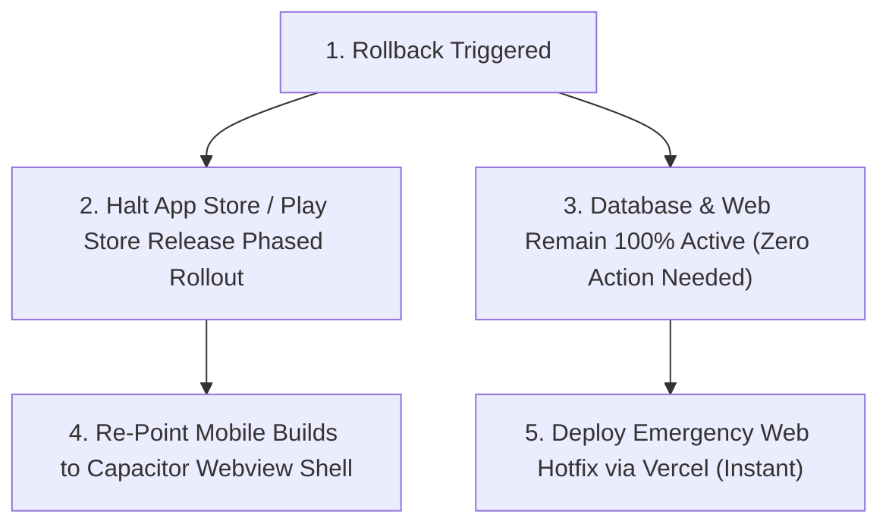

# CALYXO — PHASE 10 PRODUCTION ROLLBACK & RECOVERY PLAN

**Platform**: Calyxo Unified Health Operating System (`CALYXOAPP`)  
**Specification Type**: Phase 10 — Production Rollback & Emergency Contingency Blueprint  
**Date**: August 28, 2026  

---

## 1. Zero-Database Rollback Architecture

Because the Native-First migration followed strict **Additive Parallel Architecture**:
- **Zero Database Migrations Executed**: The production Supabase schema remained 100% unchanged.
- **Zero Table Drops or Column Renames**: The existing Web/PWA and Capacitor applications read and write to the exact same tables (`workout_logs`, `food_logs`, `user_profiles`, `subscriptions`).
- **No Data Format Conversion Required**: A rollback of the native app has **ZERO effect** on database records or Web users.

---

## 2. Emergency Rollback Triggers

An immediate production rollback to the Capacitor/Web build is triggered if:
1. **Critical Authentication Failure**: Native login fails across existing Supabase users.
2. **Crash on Launch**: Unhandled native crash on specific iOS or Android OS versions.
3. **Severe Data Corruption**: Local outbox fails to sync or drops logged workouts.
4. **App Store / Play Store Rejection**: Blocking review policy issue requiring immediate temporary fallback.

---

## 3. Step-by-Step Rollback Execution

1. **Halt Native Rollout**:
   - iOS: In App Store Connect, select "Pause Phased Release" or set rollout percentage to 0%.
   - Android: In Google Play Console, halt the phased rollout release track.
2. **Re-activate Protected Capacitor Shell**:
   - The original Capacitor configuration (`capacitor.config.json`) and Web/PWA assets in `dist/` remain completely intact in the repository.
   - Run `npx cap sync` to deploy the protected Web build immediately if needed.
3. **Web Application Continuity**:
   - The production website and PWA at `https://calyxo.app` continue serving athletes without interruption.
