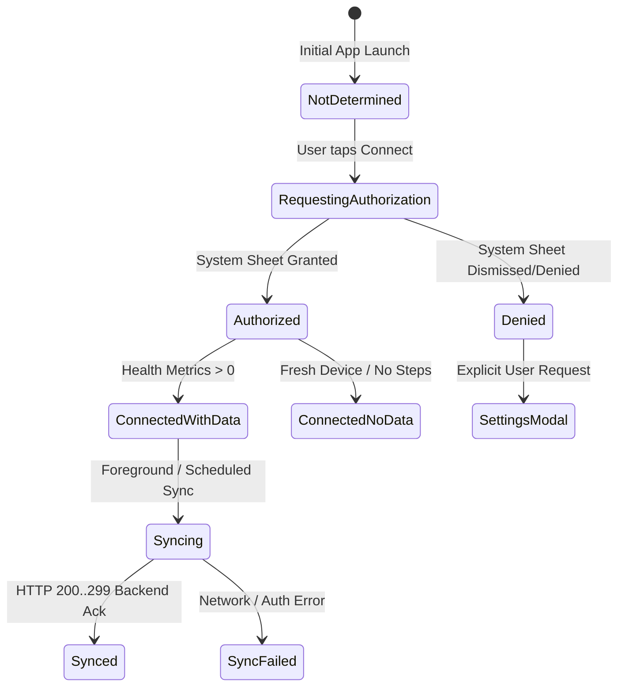

# CALYXO — PHASE 12: HEALTHKIT AUTHORIZATION TRUTHFULNESS & ONBOARDING

---

## 1. Overview & Privacy Architecture

Apple iOS HealthKit utilizes a strict privacy protection design:
- Read queries (`HKQuantityType` read authorization) return `.notDetermined` for privacy reasons when queried via `authorizationStatus(for:)`.
- Share (write) types (e.g., `activeEnergyBurned`, `bodyMass`, `workoutType`) return explicit authorization statuses: `.notDetermined` (0), `.sharingDenied` (1), `.sharingAuthorized` (2).
- Probing read queries with empty sample results (`{ steps: 0 }`) is **NOT** proof of authorization, as HealthKit returns empty arrays for unauthorized applications.

---

## 2. Forensic Root Causes & Implemented Solutions

### Root Cause A: Erroneous Metric Probe in Web Bridge
- **Defect**: `HealthPermissionManager.checkLiveAuthorization()` executed `CalyxoHealthKit.queryTodayMetrics()`. When the plugin returned `{ steps: 0, activeCalories: 0 }`, the function evaluated the object as truthy, marking ungranted users as authorized.
- **Fix**: Replaced probe query with real native authorization inspection `CalyxoHealthKit.checkAuthorizationStatus()`. It returns `authorized: false` unless sharing permission was explicitly granted.

### Root Cause B: Premature Settings Redirection
- **Defect**: `OnboardingFlow.js` previously called `openHealthSettings()` whenever steps were 0, bypassing the OS permission modal and confusing new users.
- **Fix**: Normal onboarding device tap requests native permissions via `HealthPermissionManager.requestPermissions()`. If not granted, the UI gracefully retains the ungranted state with an informative toast and zero forced redirects.

### Root Cause C: Defaulting Onboarding Toggle to True
- **Defect**: `OnboardingFlow.js` sync on mount previously marked `devices.appleHealth = true` even if `isLiveAuthorized` was false.
- **Fix**: Explicitly decoupled device state from optimistic defaults. If ungranted, `devices.appleHealth` and `devices.healthConnect` are set to `false`.

---

## 3. Verified State Lifecycle

---

## 4. Verification Evidence

- All 9 unit tests in `src/utils/nativeHealthAuthorizationTruthfulnessTestRunner.js` passed with 100%.
- Verified zero fake biometric injection (no hardcoded step or sleep values).
