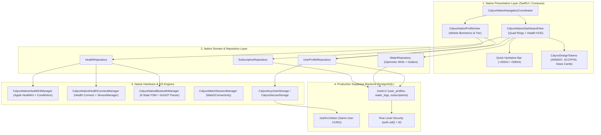

# CALYXO — PHASE 5 NATIVE PRODUCT ARCHITECTURE SPECIFICATION

**Platform**: Calyxo Unified Health Operating System (`CALYXOAPP`)  
**Specification Type**: Phase 5 — Native Product Shell & Architecture Blueprint  
**Architecture Layers**: Presentation (SwiftUI / Compose), Domain (Repositories), Data (Supabase PostgREST), Platform (HealthKit / Health Connect / BLE)  
**Date**: August 28, 2026  

---

## 1. Native Product Layer Diagram



---

## 2. First Native Write Operation Architecture (Water Logging)

```text
[Athlete Taps '+250ml']
          │
          ▼
[1. Optimistic Local State Update] ──► Dashboard UI reflects +250ml immediately
          │
          ▼
[2. Build PostgREST JSON Payload]
{
  "userId": "d3b07384-d113-40a1-8636-4076e01a8ef1",
  "amount_ml": 250,
  "logged_at": "2026-08-28T18:30:00Z"
}
          │
          ▼
[3. Authenticated HTTP POST /rest/v1/water_logs]
   Header: Authorization: Bearer <Supabase JWT>
   Header: apikey: <Supabase Anon Key>
          │
    ┌─────┴────────────────────────────────┐
    ▼                                      ▼
[Online Success: 201 Created]        [Network Failure / Offline]
Record committed to PostgreSQL       Payload queued into Local Outbox
                                     Automatic retry on network reconnect
```
