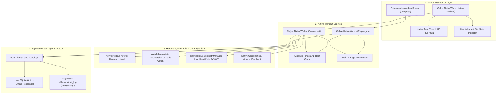

# CALYXO — PHASE 6 NATIVE WORKOUT ENGINE ARCHITECTURE SPECIFICATION

**Platform**: Calyxo Unified Health Operating System (`CALYXOAPP`)  
**Specification Type**: Phase 6 — Native Dual-Platform Workout Subsystem Architecture  
**Platforms Covered**: iOS (Swift / SwiftUI / ActivityKit), Android (Kotlin / Jetpack Compose / Java)  
**Date**: August 28, 2026  

---

## 1. Native Dual-Platform Workout Architecture

---

## 2. Dynamic Island & Apple Watch Live Set Mirroring

When an athlete taps "Done" on a set:
1. `completeSet(exerciseId, setId)` computes the new total volume.
2. `startRestTimer(seconds: 90)` sets an absolute target timestamp `Date() + 90s`.
3. `CalyxoWatchSessionManager.shared.sendWorkoutState()` broadcasts the active exercise name, set number, and countdown to the Apple Watch.
4. `CalyxoLiveActivity.swift` displays the active rest countdown on the iPhone Lock Screen and Dynamic Island.
5. Even if iOS suspends background execution, the rest timer calculates remaining time upon resume using the wall-clock delta without drift.
