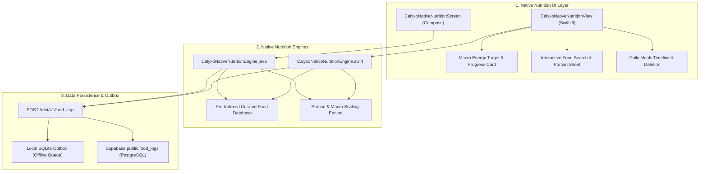

# CALYXO — PHASE 7 NATIVE NUTRITION ARCHITECTURE SPECIFICATION

**Platform**: Calyxo Unified Health Operating System (`CALYXOAPP`)  
**Specification Type**: Phase 7 — Native Dual-Platform Nutrition Subsystem Architecture  
**Platforms Covered**: iOS (Swift / SwiftUI), Android (Kotlin / Jetpack Compose / Java)  
**Date**: August 28, 2026  

---

## 1. Native Dual-Platform Nutrition Architecture

