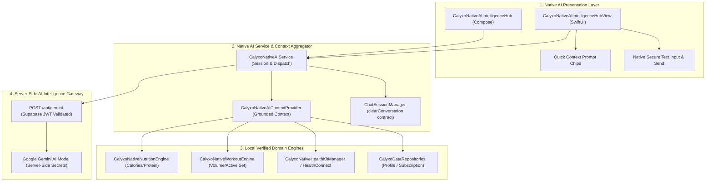

# CALYXO — PHASE 8 NATIVE AI COACH ARCHITECTURE SPECIFICATION

**Platform**: Calyxo Unified Health Operating System (`CALYXOAPP`)  
**Specification Type**: Phase 8 — Native Dual-Platform AI Coach Architecture  
**Platforms Covered**: iOS (Swift / SwiftUI), Android (Kotlin / Jetpack Compose / Java)  
**Date**: August 28, 2026  

---

## 1. Native Dual-Platform AI Coach Architecture

